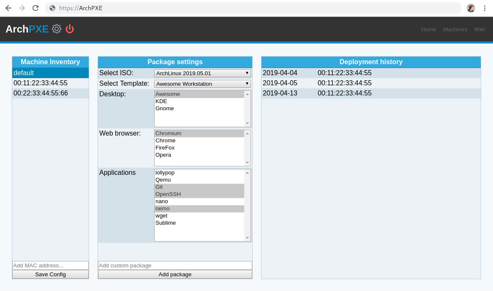

# ArchPXE *(Work in progress!)*
A PXE project with a web-front for ease of use.

# Features

 * PXE Server *(that chains [ipxe](https://ipxe.org/) to deliver a ISO-friendly bootloader)*
 * Acts as a DHCP server *(imports [slimDHCP](https://github.com/Torxed/slimDHTP))*
 * Acts as a TFTP server *(imports [slimDHCP](https://github.com/Torxed/slimDHTP))*
 * Acts as a HTTP server *(imports [slimHTTP](https://github.com/Torxed/slimHTTP))*
 * Acts as a Websocket server *(imports [spiderWeb](https://github.com/Torxed/spiderWeb))*
 * Manage machine specific boot options
 * Manage unattended/deployment profiles *(Uses [archinstall](https://github.com/Torxed/archinstall) to acomplish this)*
